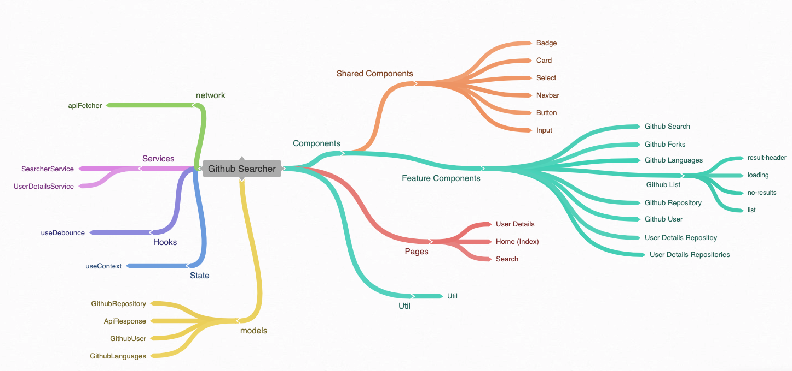
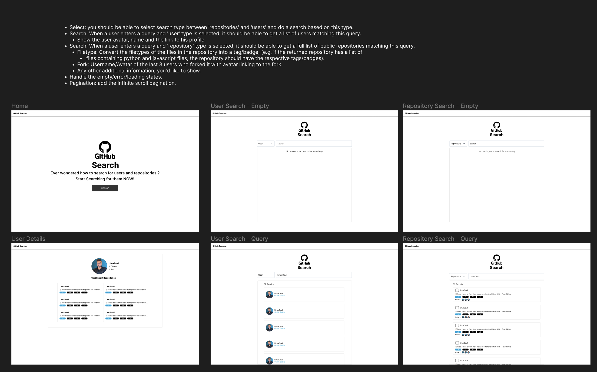

# GitHub Searcher   

<p align="center">
  
</p>

A GitHub Searcher app for searching repositories and users, built with:


## Table of Contents 📑
- [GitHub Searcher](#github-searcher-)
  - [Table of Contents 📑](#table-of-contents-)
  - [Mind Map 🗺️](#mind-map-)
  - [Figma Design 🎨](#figma-design-)
  - [Documentation 📜](#documentation-)
  - [Features 🚀](#features)
  - [Running The Project 👨🏻‍💻](#running-the-project)
  - [Running Tests 🪲](#running-tests)
  - [Docker Image 🐳](#docker-image)
  - [GitHub Actions ☢️](#github-actions)
  - [Feedback & Contribution ❤️](#feedback--contribution)


## Mind Map 🗺️
<p align="center">
  
</p>

### You can view the mind map of this project here: [GitHub Searcher Mind Map](https://coggle.it/diagram/ZNXjqVpO0W45ZHzU/t/-/fe57e44e42b79ac6325e694fa2eb2d7bffeda33d024855d8ddfa6c1bd08a7168)

## Figma Design 🎨
<p align="center">
  
</p>

### You can view the design of this project here: [GitHub Searcher Figma Design](https://www.figma.com/file/oYyDxP0tCV5z9oyUBTf3ma/Untitled?type=design&node-id=2%3A4116&mode=design&t=ZNyYT65HqdTLavxz-1)

## Documentation 📜
<p align="center">
  
</p>

### You can view the documentation of this project here: [GitHub Searcher Documentation](https://alimohammad.notion.site/Github-Searcher-Documentation-face0bf4f9494ae6b083b70a22d29d75?pvs=4)


## Features 🚀
- [x] Select: you should be able to select search type between 'repositories' and 'users' and do a search based on this type.
- [x]  Search: When a user enters a query and 'user' type is selected, it should be able to get a list of users matching this query.
    - [x]  Show the user avatar, name and the link to his profile.
- [x]  Search: When a user enters a query and 'repository' type is selected, it should be able to get a full list of public repositories matching this query.
    - [x]  Filetype: Convert the filetypes of the files in the repository into a tag/badge, (e.g, if the returned repository has a list of files containing python and javascript files, the repository should have the respective tags/badges).
    - [x]  Fork: Username/Avatar of the last 3 users who forked it with avatar linking to the fork.
    - [x]  Any other additional information, you'd like to show.
-  [x] Handle the empty/error/loading states.
-  [x] Pagination: add the infinite scroll pagination.

## Running The Project 👨🏻‍💻
To run the Github Searcher project follow these steps:
1. Install [NodeJS](https://nodejs.org/en)
2. Open the project with your IDE of choice
3. Rename the `.env.example` to `.env.local`
4. Replace the `API_TOKEN=your_github_api_token` with your [GitHub API token]('https://github.com/settings/tokens')
5. Install the dependencies `yarn install` or `npm install`
6. Run the development server `npm run dev` or `yarn run dev`
7. Open [http://localhost:3000](http://localhost:3000) with your browser.

## Running Tests 🪲
Run the `yarn test` command, it will give you a full **coverage** report.

## Docker Image 🐳
First, download docker from [here](https://www.docker.com/products/docker-desktop) and build the docker image
 ```bash
docker build -t github-searcher:development .
```

Then run the docker image
```bash
docker run -p 3000:3000 github-searcher:development
```

## GitHub Actions ☢️
The GitHub actions has these steps:
1. **Test & Lint**: It will run the jest test command and linter
2. **Build**: It will build the docker image

## Feedback & Contribution ❤️
I'm open to any feedback or contribution, just create an issue or a pull request and I will be more than happy to check it out.
